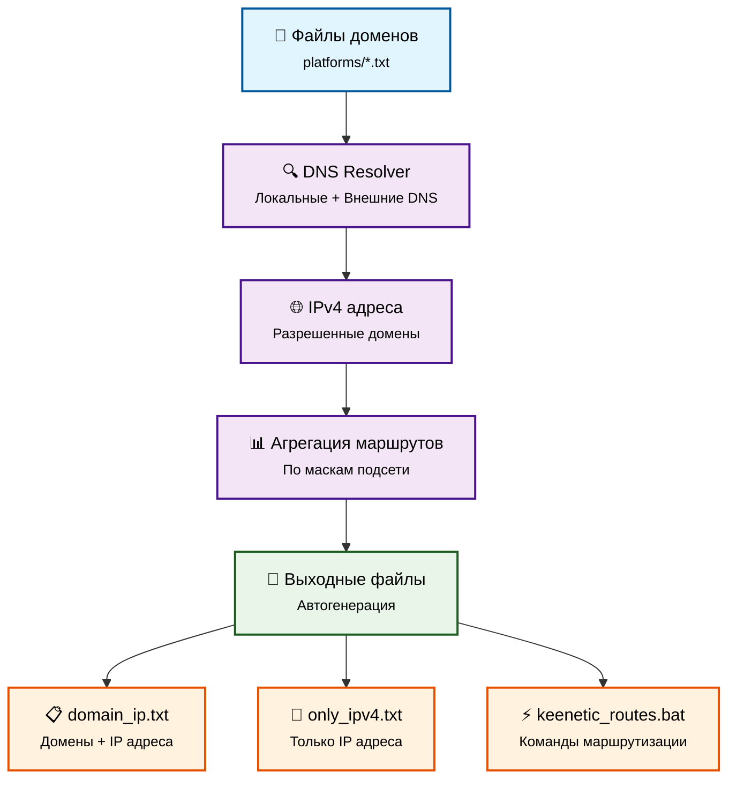

<div align="center">

# 🌐 GetIPv4 - Automated Domain to IPv4 Resolver

[](https://python.org) [](LICENSE) []()
 []() []()

**🚀 Мощный Python-инструмент для автоматизации DNS-резолвинга и генерации сетевых маршрутов**

*Превратите списки доменов в готовые к использованию IPv4 адреса и команды маршрутизации одним запуском!*

**✨ Без внешних зависимостей - только стандартные библиотеки Python 3.12+**

---

</div>

## ✨ Особенности

<table>
<tr>
<td width="50%">

### 🎯 **Основные возможности**
- 🔍 **Массовое разрешение доменов** в IPv4 адреса
- 🌐 **Поддержка множественных DNS-серверов** (локальных и внешних)
- 📊 **Агрегация маршрутов** по маскам подсети
- 📁 **Автоматическая генерация** выходных файлов
- ⚡ **Режим мониторинга** для непрерывного сбора данных
- 🛡️ **Обработка ошибок** и логирование

</td>
<td width="50%">

### 🎨 **Технические преимущества**
- 🐍 **Python 3.12+** только стандартные библиотеки
- 🚀 **Без внешних зависимостей** - простое развертывание
- 🔧 **Гибкая конфигурация** через INI файлы
- 📋 **Подробное логирование** всех операций
- 🧪 **Покрытие тестами** для стабильности
- 📚 **Подробная документация**
- 🌐 **Высокая совместимость** и портативность

</td>
</tr>
</table>

## 🚀 Быстрый старт

### 📥 Установка

```bash
# Клонируйте репозиторий
git clone https://github.com/mazixs/GetIPv4_mazix.git
cd GetIPv4_mazix

# Никаких зависимостей не требуется! Используются только стандартные библиотеки Python 3.12+
# Запустите скрипт сразу
python get_ipv4.py
```

### ⚙️ Конфигурация

Создайте файл `config.ini` с вашими настройками:

```ini
[settings]
# 📂 Файлы с доменами (через запятую)
domains_files = platforms/chatgpt.txt, platforms/ea.txt

# 📄 Выходные файлы
output_domain_ip = result/domain_ip.txt
output_only_ipv4 = result/only_ipv4.txt
output_keenetic = result/keenetic_routes.bat

# 🌐 Настройки сети
subnet_mask = 24
use_local_dns = 1
use_external_dns = 1
dns_servers = 8.8.8.8, 1.1.1.1, 208.67.222.222

# 📊 Режим мониторинга (в минутах, 0 = однократный запуск)
monitoring_duration_minutes = 0
monitoring_interval_seconds = 300

# 📝 Логирование
log_file = result/script_run.log
```

## 📋 Что делает скрипт?

<div align="center">



</div>

### 🎯 Процесс работы:

1. **🔍 Разрешение доменов**: Скрипт читает домены из указанных файлов и разрешает их через настроенные DNS-серверы
2. **📊 Агрегация маршрутов**: В зависимости от маски подсети (`/16`, `/24`, `/32`) создаются оптимизированные маршруты
3. **📁 Генерация файлов**: Автоматически создаются три типа выходных файлов для разных целей

## 📁 Структура выходных файлов

| 📄 Файл | 📝 Описание | 🎯 Назначение |
|---------|-------------|---------------|
| `domain_ip.txt` | Домены и соответствующие IPv4 адреса | Анализ и отладка |
| `only_ipv4.txt` | Список уникальных IPv4 адресов | Импорт в другие системы |
| `keenetic_routes.bat` | Команды `route ADD` для Windows/Keenetic | Настройка маршрутизации |

## 🛠️ Параметры конфигурации

<details>
<summary>📖 <strong>Подробное описание всех параметров</strong></summary>

### 📂 Файлы и пути
- **`domains_files`**: Список файлов с доменами (разделены запятыми)
- **`output_domain_ip`**: Файл для сохранения доменов и IP адресов
- **`output_only_ipv4`**: Файл только с IP адресами
- **`output_keenetic`**: Файл с командами маршрутизации
- **`log_file`**: Файл для логов (по умолчанию: `result/script_run.log`)

### 🌐 Сетевые настройки
- **`subnet_mask`**: Маска подсети для агрегации (`16`, `24`, `32`)
- **`use_local_dns`**: Использовать локальный DNS (`1` = да, `0` = нет)
- **`use_external_dns`**: Использовать внешние DNS (`1` = да, `0` = нет)
- **`dns_servers`**: Список DNS серверов через запятую

### ⏱️ Мониторинг
- **`monitoring_duration_minutes`**: Длительность мониторинга в минутах (`0` = однократный запуск)
- **`monitoring_interval_seconds`**: Интервал между проверками в секундах

</details>

## 🎮 Режимы работы

### 🔄 Режим мониторинга
```ini
# Непрерывный мониторинг в течение 60 минут с проверкой каждые 5 минут
monitoring_duration_minutes = 60
monitoring_interval_seconds = 300
```

### ⚡ Однократный запуск
```ini
# Разовое выполнение
monitoring_duration_minutes = 0
```

## 📊 Примеры использования

<details>
<summary>🎯 <strong>Настройка маршрутизации для игровых сервисов</strong></summary>

```ini
[settings]
domains_files = platforms/gaming.txt
output_keenetic = routes/gaming_routes.bat
subnet_mask = 24
dns_servers = 8.8.8.8, 1.1.1.1
```

Содержимое `platforms/gaming.txt`:
```
steam.com
origin.com
epicgames.com
battlenet.com
```

</details>

<details>
<summary>🌐 <strong>Мониторинг CDN сетей</strong></summary>

```ini
[settings]
domains_files = cdn/cloudflare.txt, cdn/aws.txt
monitoring_duration_minutes = 1440  # 24 часа
monitoring_interval_seconds = 3600   # каждый час
subnet_mask = 16
```

</details>

## 🧪 Тестирование

```bash
# Запуск всех тестов
python -m pytest tests/ -v

# Запуск с покрытием
python -m pytest tests/ --cov=. --cov-report=html
```

## 📚 Документация

- 📋 [Отчет аудита](docs/audit_report.md) - Полный анализ проекта (оценка 8.0/10)
- 🐍 [Лучшие практики Python](best_practice/python.md)

### 🔧 Технологический стек

**Используемые стандартные библиотеки Python 3.12+:**
- `socket` - DNS-разрешение и сетевые операции
- `ipaddress` - работа с IP-адресами и сетевыми масками
- `configparser` - обработка конфигурационных файлов
- `logging` - структурированное логирование
- `pathlib` - современная работа с файловыми путями
- `datetime` - временные метки и мониторинг
- `argparse` - обработка аргументов командной строки
- `unittest` - модульное тестирование

## 🤝 Участие в разработке

<div align="center">

### 🌟 Мы приветствуем ваш вклад!

[](https://github.com/mazixs/GetIPv4_mazix/issues)
[](https://github.com/mazixs/GetIPv4_mazix/pulls)
[](https://github.com/mazixs/GetIPv4_mazix/discussions)

</div>

### 🚀 Как внести вклад:

1. 🍴 **Fork** репозиторий
2. 🌿 Создайте **feature branch** (`git checkout -b feature/amazing-feature`)
3. 💾 **Commit** ваши изменения (`git commit -m 'Add amazing feature'`)
4. 📤 **Push** в branch (`git push origin feature/amazing-feature`)
5. 🔄 Откройте **Pull Request**

### 📝 Правила разработки:
- ✅ Следуйте [PEP 8](https://pep8.org/)
- 🧪 Добавляйте тесты для новой функциональности
- 📚 Обновляйте документацию
- 🔍 Используйте типизацию Python
- 🚀 **Только стандартные библиотеки** - не добавляйте внешние зависимости
- 🌐 Обеспечивайте совместимость с Python 3.12+

## 📄 Лицензия

<div align="center">

**GNU General Public License v3.0** - см. файл [LICENSE](LICENSE) для подробностей

---

### 💝 Сделано с ❤️ для сообщества

*Если проект оказался полезным, поставьте ⭐ звездочку!*

[](https://github.com/mazixs/GetIPv4_mazix) [](https://github.com/mazixs/GetIPv4_mazix/fork) [](https://github.com/mazixs/GetIPv4_mazix)

</div>
